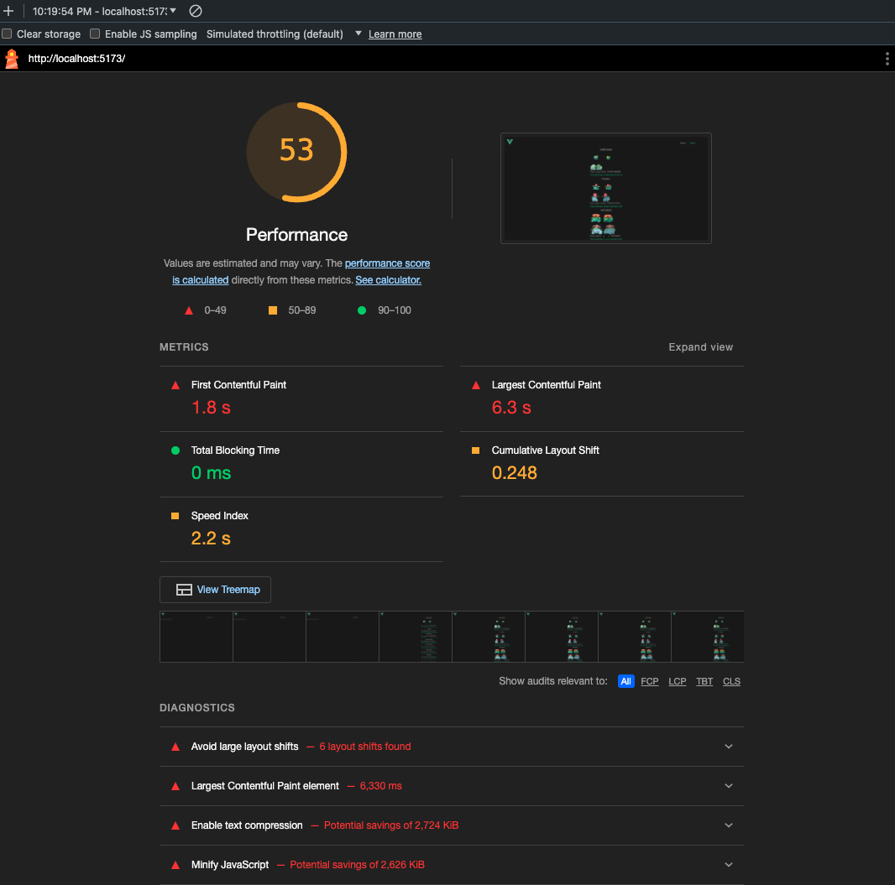

# ugly-performnace-examples

This project wants to provide some examples about how do not handle performance in frontend.

Also i want to include devs solutions so feel free to create a new version solving this issues.

## Examples

### pokedex main view

this file is implemented poorly to include performance problems on a simple ~30 dataset api call.

bad component `src/components/original/PokedexHome.vue`

#### problems

- bad await handling
- cls
- lcp

#### how to contribute with a solution

- copy the original folder in the same dir with a diferent name
- choose a diferent name
- update input on homeview.vue
- start refactoring :) (dont forget comments to learn about ytour solution)
- send a PR including lighthouse evidence

```shell
# example using pokedexgallem as my unique name
cp -r src/components/original src/component/pokedexgallem
```

current score on lighthouse



## Customize configuration

See [Vite Configuration Reference](https://vitejs.dev/config/).

## Project Setup

```sh
npm install
```

### Compile and Hot-Reload for Development

```sh
npm run dev
```

### Type-Check, Compile and Minify for Production

```sh
npm run build
```

### Lint with [ESLint](https://eslint.org/)

```sh
npm run lint
```
